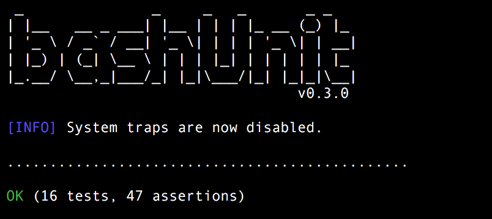
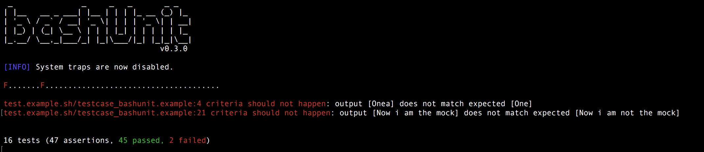

# bashUnit [](https://travis-ci.org/athena-oss/bashunit)

bashUnit is a testing framework for bash and has support for :

* [Assertions](#assertions) on :
  * [return codes](#return)
  * [exit codes](#exit-code)
  * [outputs](#output)
  * [values](#values)
  * [strings](#string)
  * [arrays](#array)
* [Mocking](#mocking)
* [Handling temporary files/directories](#other-useful-features)
* [Code Coverage](#code-coverage) (approximate coverage)

For the full API, please have a look at the functions in the scripts inside the lib directory and/or have a look at real testcases that use bashUnit to execute them.

## Mocking

This is a very important part of testing because it allows you to *fake* third-party functions that you don't care to test while testing your code. The best way to include these types of functions in your code, so that you can mock later, is to not use them directly, but instead, create a wrapper around it. Using this method you will be able to mock the wrapper and your code will be easy to test.

### Example: mocking grep
```bash
# in your code
function my_grep()
{
  grep $@
}

function my_function_that_uses_grep()
{
  if my_grep "val" $1; then
    return 1
  fi
  return 0
}

# in your test
bashunit.test.mock.returns "my_grep" 0
bashunit.test.assert_return "my_function_that_uses_grep" 1
```

## Testcases

For bashUnit to acknowledge a file containing tests as a *TestSuite*, you need to respect the following conventions :

  * File **MUST** follow the pattern `test.<functions_to_test>.sh`
  * Functions inside this file **MUST** follow the pattern `testcase_<name_of_the_function_to_test>()`

### Example : test.example.sh
```bash
function testcase_my_function()
{
  ...
}
```

## Assertions

You can do assertions on :

### Values
```bash
bashunit.test.assert_value "One" "One"
bashunit.test.assert_value.expects_fail "One" "Two"
```

### Output
```bash
bashunit.test.assert_output "_my_function" "OK" "pass"
bashunit.test.assert_output.expects_fail "_my_function" "OK" "fail"
```

### Return
```bash
bashunit.test.assert_return "_my_function" "pass"
bashunit.test.assert_return.expects_fail "_my_function" "fail"
```

### Exit code
```bash
bashunit.test.assert_exit_code "_my_function_with_exit_0"
bashunit.test.assert_exit_code.expects_fail "_my_function_with_exit_1"
```

### String
```bash
bashunit.test.assert_string_contains "my string" "my"
bashunit.test.assert_string_contains.expects_fail "my string" "xpto"
```

### Array
```bash
bashunit.test.assert_array expected_array result_array
```

## Other useful features

There are a few other useful features that you can use while implementing tests :

* Create temporary directories

```bash
tmpdir=$(bashunit.test.create_tempdir)
```


* Create temporary files

```bash
tmpfile=$(bashunit.test.create_tempfile)
```

## Executing the Testsuites
```bash
$ bashunit <target_dir|target_file> [<source_dir> [list]] [--bootstrap=</path/to/file>]
```

**Notes:**
* The `bootstrap_file` is used to source/load your scripts in order to be able to use them in the tests. If this flag is not specified then `bashUnit` will look for a file called `bashunit-bootstrap.sh` inside the tests directory.


### Example: Running bashUnit testcases

```bash
$ ./bashunit test/
```

### Example: Successful run

```bash
$ ./bashunit test/
```


### Example: Run with some errors

```bash
$ ./bashunit test/
```


## Code Coverage
* The `<source_dir>` is used to calculate approximate code coverage by checking if functions in source_dir contain testcases for it, e.g.:
	````bash
	function my_function() {
		...
	}
	```
	must have a testcase with the following name
	```bash
	function testcase_my_function() {
		...
	}
	```

* The `list` parameter is used to show which functions are not being tested

## Quick start

Prerequisites
 * You have a `bash` shell.

There are three quick start options available:

* On MAC OSX using [Homebrew](http://brew.sh/) :
```bash
$ brew tap athena-oss/tap
$ brew install bashunit
```
* [Download the latest release](https://github.com/athena-oss/bashunit/releases/latest)
* Clone the repo: `git clone https://github.com/athena-oss/bashunit.git`
